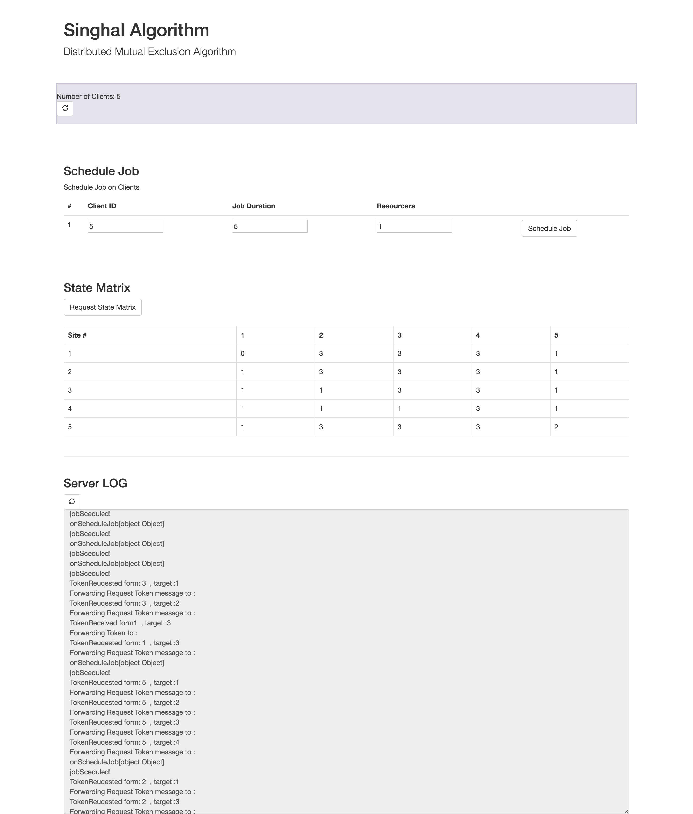
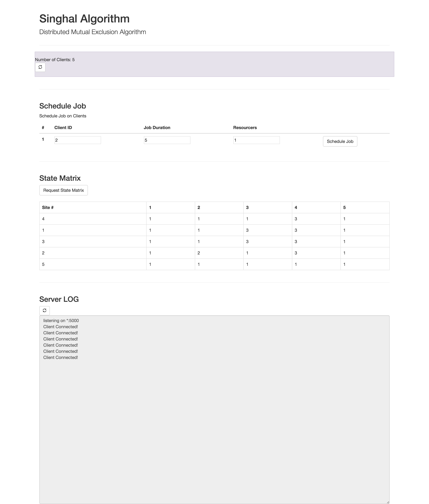

# Singhal
Singhal Algorithmi is a algorithm for mutual exclusion on a distributed system. [[Paper](http://www.utdallas.edu/~praba/singhal.pdf)]

# Notes
This was a part of C40534 assigments.

# Screenshots

